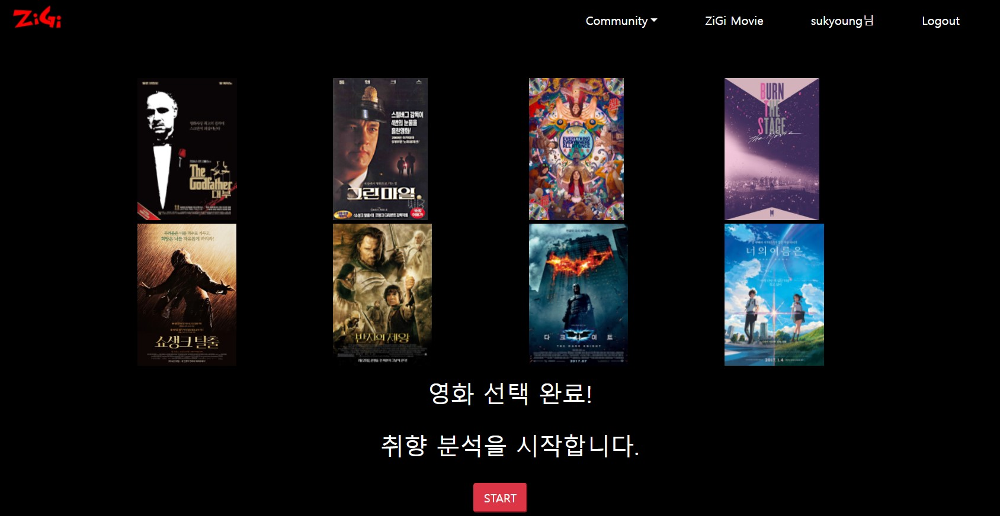
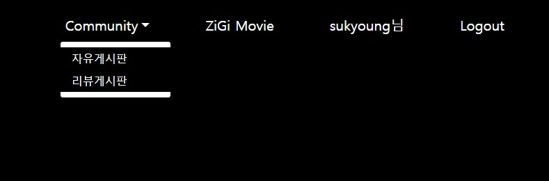

# 🍟ZiGi Project

## 🌯프로젝트 개요

- **프로젝트명**: 지기극장(ZIGI Theater)

- **팀명**: 미소지기😄

- **팀원**: 권기정, 지수경

- **시작 일시**: 2022.05.17(화)

- **완료 일시**: 

- **기술 스택**

  

## 🍔프로젝트 컨셉 및 주요 기능

### 프로젝트 컨셉

**"옛날 영화 추천"**

최신 영화의 경우 추천을 받아봤자 이미 봤을 확률이 크다.

특히 20-30대의 젊은 사용자들은 옛날 영화를 쉽게 접하지 못한다.

그들의 취향에 맞는 '80, 90년대 개봉 영화'를 추천해주는 서비스를 개발하기로 했다.

### 주요 기능

#### 영화 추천 기능

1. 좋아하는 유명 최신 영화 8개 고르기
2. 선택된 8개 영화 토너먼트 진행
3. 순위 별로 장르 점수 차등 계산
   - 1등: 3점
   - 2등: 2점
   - 3-4등: 1점 
4. 선호 장르 계산
   - 영화: 6개(점수 바탕 장르 랜덤)

#### 커뮤니티 기능

- 영화 후기 게시판

  영화 제목, 장르, 평점, 후기/ 댓글

- 자유 게시판

  글 제목, 글 내용/ 댓글

## 🌮디자인

### 디자인 컨셉

**멋진 고-급 극장🍿**

### 화면구성

1. 네이게이션 바
   - 로그인 전
     - 좌측: HOME TAB(로고)
     - 중앙: 영화 추천(ZIGI MOVIE), 영화 후기(후기), 자유 게시판(ZIGI 광장)
     - 우측: 로그인(로그인), 회원가입(회원가입)
   - 로그인 후
     - 좌측: HOME TAB(로고)
     - 중앙: 영화 추천(ZIGI MOVIE), 영화 후기(후기), 자유 게시판(ZIGI 광장)
     - 우측: 회원정보(이름), 로그아웃(로그아웃)

3. 메인 화면

   - 극장 간판(지기 극장)

   - 동영상 or 옆으로 넘어가는 포스터들

   - 영화 목록(카드) - pagenation

     

4. 영화 추천 화면

   

5. 영화 후기 화면

   영화 제목, 장르, 평점, 후기/ 댓글

   

6. 자유 게시판 화면

   글 제목, 글 내용/ 댓글

   

7. 회원정보 화면

   이름, 이메일(아이디), 회원 정보 변경, 작성한 글/댓글

## 역할 분담

권기정: Django API 데이터 수집, Vue 추천 알고리즘 기획 및 구현, 컨셉 디자인

지수경: Django, Vue, 컨셉 

## 상세 기능 설명

### Movie

메인 화면

메인 화면 스크롤 시 인기 영화 상위 50개 리스트

영화 목록 클릭 시 영화 상세 페이지 이동

### 추천 기능

50개 인기 영화 중 취향에 맞는 총 8개 영화 선택

토너먼트 방식으로 취향 분석

취향 분석을 바탕으로 영화 추천

1. 순위 별로 장르 점수 차등 계산
   - 1등: 3점
   - 2등: 2점
   - 3-4등: 1점 
2. 선호 장르 계산
   - 영화: 6개(점수 바탕 장르 랜덤)

추천 영화 클릭 시 상세 페이지 이동

### Community

두 가지 게시판

#### 자유게시판

#### 리뷰게시판

리뷰 상세페이지

제목에 맞는 영화 정보 연결

리뷰 생성 페이지(별점 기능 등)

### Account

내가 작성한 글과 리뷰 목록 확인 및 접근 가능

## 느낀점

### 지수경

수업시간에 배운 장고와 뷰를 활용해 직접 처음으로 완전한 홈페이지를 만들 수 있어서 재미있었다. 밤도 많이 새고 힘들었지만 생각보다 퀄리티 있는 서비스가 만들어져서 뿌듯하다.

처음에 계획했던 기능을 거의 구현했지만 추가적으로 생각했던 아이디어들을 많이 활용하지 못해서 아쉽다. 나중에 공부를 더 열심히 해서 내 아이디어를 모두 적용한 프로젝트를 진행해보고 싶다.

프로젝트를 진행하면서 초기 모델링과 프로토타입 구성이 중요하다는 것을 깨달을 수 있었다.

### 권기정

이전에 배웠던 Django의 MTV 패턴에서 좀 더 기능이 많고 설계가 잘되어 유지보수에 용이한 MVVM 패턴을 경험 할 수 있었다. 알고리즘 등의 기능을 Vuex 또는 Django 두 군데에서 구현 할 수 있었지만, Vuex에 ViewModel의 기능을 추가하는 것이 바람직하다고 판단했다. 하지만 store 내부에 모듈을 나눠 놓은 것을 잘 활용하지 못해 index파일에 너무 많은 것들을 집어 넣어 아쉬웠다.

아무리 열심히 모델링을 해도 결국 만들어 봐야 또 필요한 것이 무엇인지 알 수있다는 에자일 전략을 경험해 볼 수 있었다.
